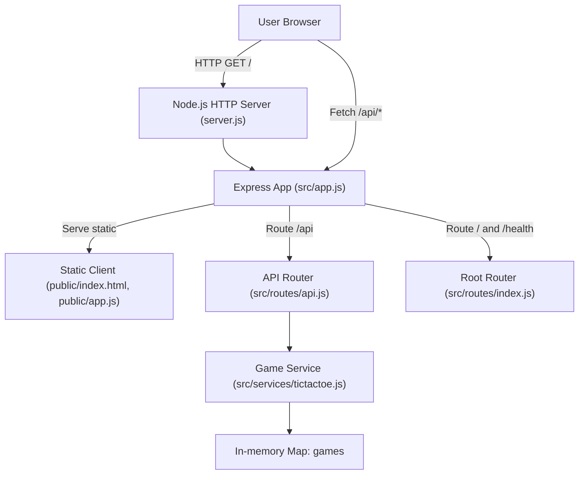

# Architecture Overview — Tic-Tac-Toe (tictactoeplan0717)

## Overview

This repository is a small single-process web application consisting of:

1. A Node.js HTTP server running an Express app.
2. A JSON REST API under `/api` that implements Tic-Tac-Toe operations.
3. A static browser client (HTML + vanilla JS) served by the same Express process.

The system is intentionally simple and uses in-memory storage for game state.

## High-level system diagram



## Containers and components

### Node.js HTTP server (`server.js`)

The entry point creates an HTTP server and mounts the Express app returned by `createApp()`.

Responsibilities include:

1. Reading runtime configuration (`PORT`, `HOST`).
2. Binding to `0.0.0.0` by default for container/preview environments.
3. Minimal startup logging.
4. Graceful shutdown on SIGTERM/SIGINT.

### Express application (`src/app.js`)

`createApp()` configures middleware and mounts routers.

Key responsibilities include:

1. Minimal request logging middleware that prints method, URL, status code, and duration.
2. JSON parsing middleware via `express.json()`.
3. Static asset serving from `public/`.
4. Routing:
   - `/api` to API router.
   - `/` and `/health` to root router.
5. A fallback 404 handler returning JSON `{ status: "error", error: "Not found" }`.

### Root routes (`src/routes/index.js`)

This router handles non-API routes:

1. `GET /` sends `public/index.html` explicitly (static middleware also serves it, but this route makes the behavior explicit).
2. `GET /health` returns `{ status: "ok", port: <effective port> }`.

### API routes (`src/routes/api.js`)

This router is mounted at `/api` and exposes the game API.

Key characteristics:

1. A single `TicTacToeService` instance is created at module load time and lives for the lifetime of the process.
2. Errors are returned consistently as JSON `{ "error": "<message>" }`.

### Game service (`src/services/tictactoe.js`)

This module implements all core game logic and state storage.

Responsibilities include:

1. Creating a new game with an empty board.
2. Fetching an existing game by ID.
3. Applying moves with validation (bounds, game status, occupied cells).
4. Determining win/draw status.
5. Returning a “public” copy of game state to avoid external mutation of the internal board.

### Static client (`public/index.html`, `public/app.js`)

The browser UI is plain HTML, inline CSS, and a small JS file.

Key behaviors:

1. On page load, the UI automatically calls `POST /api/games` and renders the board.
2. Clicking a cell calls `POST /api/games/:id/moves`.
3. The UI disables occupied cells and prevents moves once the game ends.
4. On move error, it displays an error message and then re-fetches game state from the server for consistency.

## Request flow

### UI load

1. Browser requests `GET /`.
2. Express serves `public/index.html`.
3. Browser loads `/app.js` (served via static middleware).
4. Client calls `POST /api/games` to create a new game.
5. Server responds with the initial game state.
6. Client renders board and status text.

### Making a move

1. User clicks a cell button.
2. Client calculates `{ row, col }` from the clicked index.
3. Client calls `POST /api/games/:id/moves` with JSON body.
4. API route validates body and delegates to `TicTacToeService.makeMove(...)`.
5. Service validates move, updates board, computes win/draw/in_progress, toggles player if needed.
6. API returns updated state; client re-renders.

### Health check

1. A monitor calls `GET /health`.
2. Server responds with JSON payload containing `status` and the effective port.

## Endpoint summary

### Root

1. `GET /`  
   Returns the static UI HTML.

2. `GET /health`  
   Returns:

```json
{ "status": "ok", "port": 3001 }
```

### API (mounted at `/api`)

1. `POST /api/games`  
   Creates a game. Returns `201` with game state.

2. `GET /api/games/:id`  
   Returns `200` with game state, or `404` with `{ "error": "Game not found" }`.

3. `POST /api/games/:id/moves`  
   Applies a move. Returns `200` with updated game state, or an error.

## API examples

### Create game

```bash
curl -s -X POST http://localhost:3001/api/games
```

Response (`201`):

```json
{
  "gameId": "0e0d2a29-9b7a-4c60-8f6d-76b38d3b7a73",
  "board": [[null, null, null], [null, null, null], [null, null, null]],
  "nextPlayer": "X",
  "status": "in_progress"
}
```

### Make move (with validation errors)

Invalid body example:

```bash
curl -s -X POST http://localhost:3001/api/games/ID/moves \
  -H 'Content-Type: application/json' \
  -d '{ "row": "0", "col": 0 }'
```

Response (`400`):

```json
{
  "error": "Invalid request body: expected JSON { \"row\": number, \"col\": number }"
}
```

Unknown game example:

```bash
curl -s -X POST http://localhost:3001/api/games/does-not-exist/moves \
  -H 'Content-Type: application/json' \
  -d '{ "row": 0, "col": 0 }'
```

Response (`404`):

```json
{ "error": "Game not found" }
```

## Data model

### Game state (JSON)

The API returns a game object with:

1. `gameId` (string): UUID created with `crypto.randomUUID()`.
2. `board` (3x3 array): values are `"X"`, `"O"`, or `null`.
3. `nextPlayer` (`"X"` or `"O"`): the player whose turn it is when `status` is `in_progress`. (Note: the service keeps `nextPlayer` unchanged when the game finishes.)
4. `status` (`"in_progress" | "won" | "draw"`).
5. `winner` (`"X" | "O"`, optional): present only when status is `won`.

### In-memory storage

The service stores games in a process-local `Map<string, Game>`.

Implications:

1. Restarting the server clears all games.
2. Multiple server instances will not share state.
3. This is suitable for a demo/reference app and can be extended with a persistence layer.

## Error handling

### API error shape

The API router returns errors consistently as:

```json
{ "error": "<message>" }
```

Typical error cases include:

1. `404 Game not found` for unknown `gameId`.
2. `400 Invalid request body` if `row` or `col` are not integers.
3. `400 Invalid move` if out of bounds, cell occupied, or game already finished.

### App-level 404

If a route is not matched, the Express app returns:

```json
{ "status": "error", "error": "Not found" }
```

with HTTP status `404`.

## Configuration

Runtime configuration is environment-variable driven:

1. `PORT`: port to listen on. Defaults to `3001`.
2. `HOST`: bind host. Defaults to `0.0.0.0`.

The `/health` endpoint echoes the effective port (derived from `process.env.PORT` or the 3001 default).

## Observability and logging

Logging is intentionally minimal:

1. `server.js` logs one startup line showing the bound host/port.
2. `src/app.js` logs each request after response finish:
   - method
   - original URL
   - HTTP status code
   - duration in ms

There is no structured logging, metrics, or tracing yet.

## Operational notes

1. Local run: `npm install && npm start`.
2. Default address: `http://0.0.0.0:3001` (or `http://localhost:3001` from the host).
3. Preview/container environments typically require binding to `0.0.0.0` and using port 3001; this repository is configured accordingly.
4. The app is a single Node process; scaling out would require state externalization.

## Extension points

The current structure is intentionally easy to extend.

1. Persistence layer: replace or wrap the in-memory `Map` with a storage adapter (SQLite/Postgres/Redis). A natural refactor is to inject a repository into `TicTacToeService`.
2. Authentication: add middleware in `src/app.js` for `/api` routes (bearer tokens, sessions, etc.).
3. Tests:
   - Unit tests for `src/services/tictactoe.js` (winner detection, validation).
   - Integration tests for `src/routes/api.js` (HTTP status and JSON shapes).
4. OpenAPI: document `/api` endpoints formally with an OpenAPI spec (and optionally generate a client).
5. UI enhancements: show winning line, move history, and better error presentation without changing the API.
